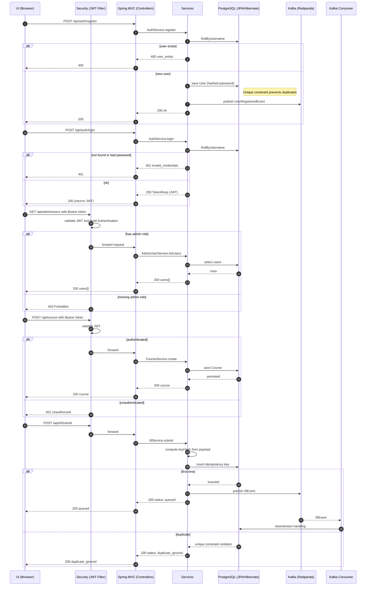

# Backend

Spring Boot 3 service that provides authentication (JWT) and course management, and accepts Salesforce-style (SF) submissions with **idempotency** and **Kafka** publishing. Persistence is **PostgreSQL** (JPA/Hibernate). Kafka used locally via **Redpanda**.

## High-level logic

- **Auth & Users**
  - `AuthController` — registration and login. On register, hashes password and persists `User`; on login, issues JWT (`sub=username`, `role` claim).
  - `SecurityConfig` — configures the JWT filter, public/secured routes and role checks (`/api/admin/**` requires `ROLE_ADMIN`).
  - `AdminUserController` — admin endpoints: list users and change a user's password.

- **Courses**
  - `CourseController` — CRUD for courses and listing courses by instructor.
  - `Course` / `CourseRepository` — JPA entity and repository.

- **Salesforce-style submissions**
  - `SfController` — accepts inbound SF-like requests (`POST /api/sf/submit`), computes a stable hash from key fields, performs **idempotent reservation** via `SfIdempotencyRepository.tryReserveFirstSend(...)`. Only the **first** submit proceeds to Kafka; duplicates return `duplicate_ignored`.
  - `SfIdempotencyEntity` / `SfIdempotencyRepository` — table with unique hash/PK; first insert wins, duplicates are detected by `DataIntegrityViolationException` (unique index).

- **Kafka**
  - On successful user registration (if enabled and topic set), publishes `UserRegisteredEvent`.
  - On first SF submit, publishes an event to Kafka.
  - Consumers (in this service or another) can process these events asynchronously.

- **Errors**
  - Business and integration failures can be represented by `KafkaSfException` with a typed `Errors` code; a global handler can translate them into stable HTTP responses.

---

## Controllers & endpoints

### AuthController (`/api/auth`)
- `POST /register` — registers a user.
  - Validates `username` uniqueness.
  - Password is stored as a hash (`PasswordEncoder`).
  - Side effect: best-effort publish `UserRegisteredEvent` to Kafka (if enabled).
  - Responses: `200 OK {status:"ok"}` or `400 {error:"user_exists"}`.

- `POST /login` — authenticates and issues a JWT.
  - Checks user existence and password match (`PasswordEncoder.matches`).
  - Returns `TokenResp {token, expiresInSec, username, role}`.
  - Responses: `200 OK` or `401 {error:"invalid_credentials"}`.

- `GET /api/auth/me` — (diagnostic) returns `principal` and `roles` from the current SecurityContext.

### AdminUserController (`/api/admin/users`) — requires `ROLE_ADMIN`
- `GET /api/admin/users` — list all users (username, role).
- `PUT /api/admin/users/{username}/password` — change password for a user (re-hashes and saves).

### CourseController (`/api/course`)
- `GET /api/course/{id}` — read course by id.
- `POST /api/course` — create course.
- `PUT /api/course/{id}` — update course.
- `DELETE /api/course/{id}` — delete course.
- `GET /api/course/by_instructor/{instructorId}` — list courses for a given instructor.

### SfController (`/api/sf`)
- `POST /api/sf/submit` — accept an SF-style submission.
  - Builds a **stable hash** from normalized fields (e.g., `email|fullName|message`, with `null`→`""`) to identify a logical submission.
  - Calls `SfIdempotencyRepository.tryReserveFirstSend(email, keyHash)`:
    - on success (first insert) → publish to Kafka → return `{"status":"queued"}`.
    - on unique-constraint violation → duplicate → return `{"status":"duplicate_ignored"}`.
  - Kafka publish is best-effort: failures should not break HTTP; log/metric appropriately.

---

## Data flow

### 1) Registration & Login
1. Client calls `POST /api/auth/register {username, password, role}`.
2. Controller checks uniqueness, hashes the password, persists `User`.
3. If Kafka is enabled, publishes `UserRegisteredEvent(username, role, occurredAtMillis)`.
4. Client logs in via `POST /api/auth/login` and gets a JWT.
5. Subsequent calls include `Authorization: Bearer <token>`; the security filter validates signature, extracts `sub`/`role`, and sets `ROLE_*` authority in the `Authentication`.

### 2) Admin access
1. Admin logs in and gets a token with ADMIN role.
2. `GET /api/admin/users` passes `hasRole("ADMIN")` check.
3. Controller reads users from Postgres and returns DTOs.

### 3) SF submit & Kafka publish (idempotency)
1. Client calls `POST /api/sf/submit {email, fullName?, message? ...}`.
2. Controller normalizes fields and computes `keyHash` (e.g., SHA-256).
3. Repository attempts to insert `{keyHash, email}` into `sf_idempotency`:
   - if insert succeeds → first occurrence: send event to Kafka → `{"status":"queued"}`.
   - if DB raises `DataIntegrityViolationException` → duplicate: `{"status":"duplicate_ignored"}`.
4. Kafka consumers receive the event and continue processing (downstream orchestration, external systems, etc.).

---

## Persistence

- **PostgreSQL** with Spring Data JPA/Hibernate:
  - `User` → table `app_user`.
  - `Course` → table `course`.
  - `SfIdempotencyEntity` → table with unique column/PK `keyHash`.
- For dev/test: `spring.jpa.hibernate.ddl-auto=update`. For prod: use Flyway/Liquibase.

---

## Kafka

- Local broker: **Redpanda** (Kafka-compatible).
- Topic configured via `app.kafka.topic`. Enable/disable via `app.kafka.enabled=true/false`.
- Event publishing (user registration, first SF submit) is **best-effort**: HTTP flow remains stable even if broker is down (log/metrics recommended).

---

## Security

- JWT: configure secret and TTL in `application.yml` (`app.jwt.secret`, `app.jwt.ttlMinutes`).
- The JWT filter validates the token, extracts `sub` and `role/roles`, and normalizes authorities as `ROLE_*`.
- Access rules:
  - `permitAll`: `/api/auth/**`.
  - `hasRole("ADMIN")`: `/api/admin/**`.
  - others: `authenticated`.

---

## Diagram



## Configuration (sample)

```yaml
spring:
  datasource:
    url: jdbc:postgresql://localhost:5432/uikafkasf
    username: postgres
    password: postgres
  jpa:
    hibernate:
      ddl-auto: update
    database-platform: org.hibernate.dialect.PostgreSQLDialect

app:
  jwt:
    secret: <your-dev-secret>
    ttlMinutes: 120
  kafka:
    enabled: true
    topic: sf.events

logging.level:
  org.springframework.security: DEBUG
```

---

## Local run

```bash
# From project root:
docker compose up -d postgres redpanda redpanda-console

# Start backend
./gradlew :backend:bootRun
```

Quick test:
```bash
# Register admin
curl -X POST http://localhost:8080/api/auth/register   -H 'Content-Type: application/json'   -d '{"username":"admin","password":"admin123","role":"ADMIN"}'

# Login -> get token
curl -X POST http://localhost:8080/api/auth/login   -H 'Content-Type: application/json'   -d '{"username":"admin","password":"admin123"}'
```

---

## Tests

Depending on configuration, integration tests may spin up containers (Testcontainers) or reuse local Postgres. Run:

```bash
./gradlew :backend:test --info
```

---

## Troubleshooting

- **403 on `/api/admin/users`**: ensure the token contains ADMIN role and the context has `ROLE_ADMIN`. Check `/api/auth/me`.
- **Hibernate “Unable to determine Dialect…”**: set `spring.datasource.url` and ensure PostgreSQL driver present.
- **SF submit always `duplicate_ignored`**: ensure stable hash (normalize `null→""`) and a unique index on `keyHash`.
- **Kafka down**: HTTP should not fail; enable WARN/ERROR logs and consider `app.kafka.enabled=false` for local dev.
