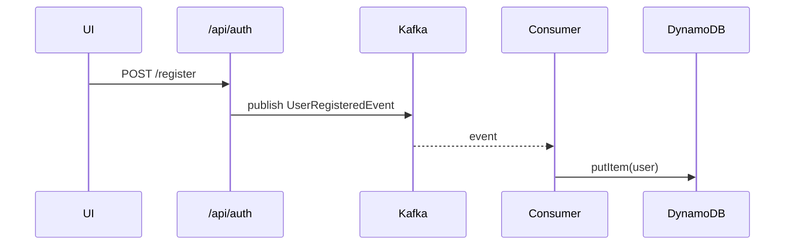

# Backend

Spring Boot 3 app with auth + Kafka + DynamoDB.

## Structure
```
backend/
  src/main/java/com/example/ui_kafka_sf/
    UiKafkaSfApplication.java
    auth/ (controllers, DTOs, JWT utils, repository)
    sf/ (Kafka configs, events)
    common/ (Errors, exceptions, global exception handler)
  src/main/resources/application.yml
```

## Run
```bash
# Dev infra (LocalStack + Redpanda)
cd ../localstack && docker compose up -d && cd -

# Run backend
../gradlew :backend:bootRun
```

## API (curl)
```bash
# Register STUDENT
curl -X POST http://localhost:8080/api/auth/register   -H 'Content-Type: application/json'   -d '{"username":"alice@example.com","password":"pwd12345","role":"STUDENT"}'

# Login
curl -X POST http://localhost:8080/api/auth/login   -H 'Content-Type: application/json'   -d '{"username":"alice@example.com","password":"pwd12345"}'
```

## Tests (Testcontainers)
Runs Kafka + LocalStack containers automatically.
```bash
../gradlew :backend:test --info
```

## Mermaid — simplified flow


## Restarting pieces
- **Backend only**: `../gradlew :backend:bootRun`
- **Infra only**: `cd ../localstack && docker compose restart`
- **Clean-rebuild**: `../gradlew clean :backend:build`
