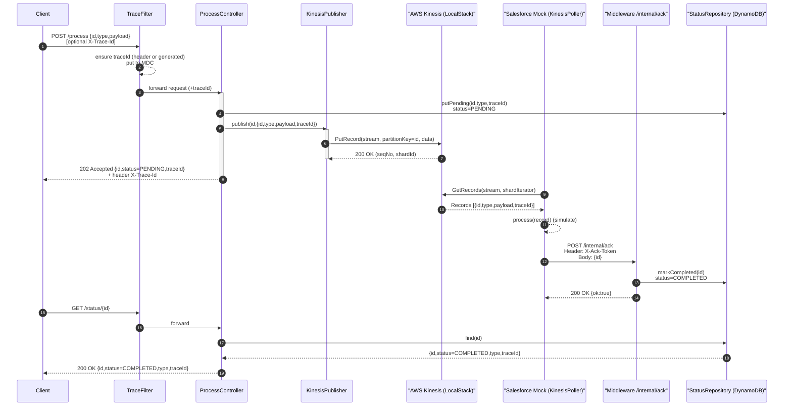
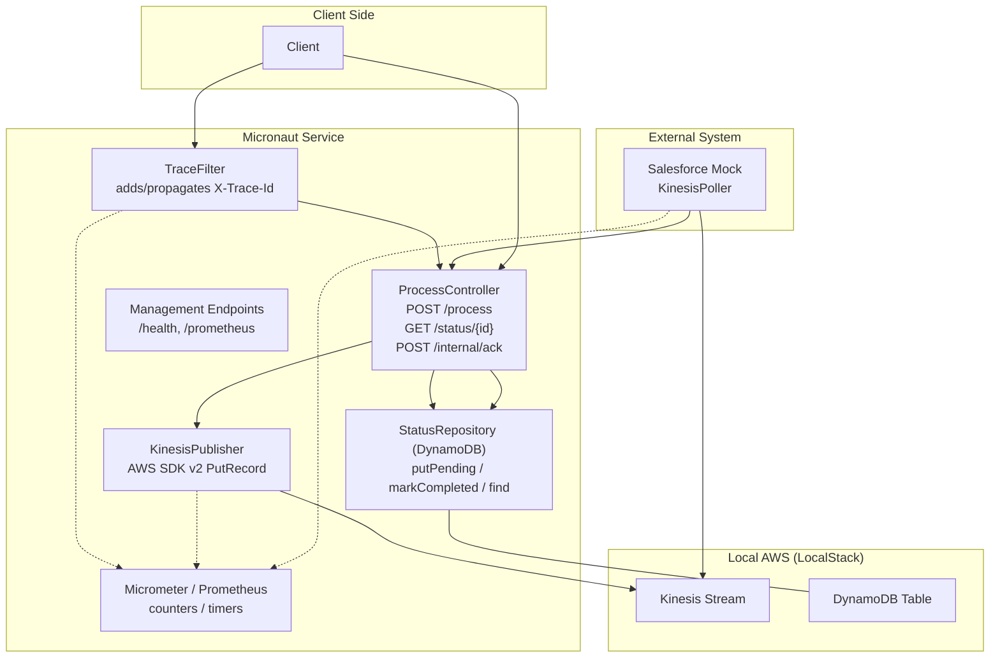
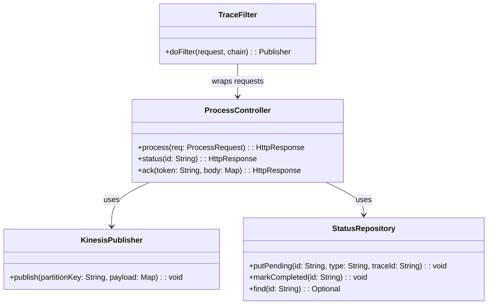

# mn-kinesis-middleware

A Micronaut 4 demo showcasing an async middleware pattern with:
- **REST ingress** → **AWS Kinesis** (via LocalStack in dev/tests)
- **External consumer (Salesforce mock)** → **ACK callback**
- **Status polling** by the client
- **Tracing** (`X-Trace-Id` header + MDC)
- **Metrics** (Micrometer + Prometheus), **Health** endpoints
- **Testcontainers** for integration tests

> Modules:
> - `middleware-service` — main Micronaut service that accepts client requests, writes to Kinesis, persists status in DynamoDB, and exposes `/status` & internal `/internal/ack`.
> - `salesforce-mock` — mock “Salesforce” processor that consumes from Kinesis and calls back ACK.

---

## 1) How the system works (end-to-end flow, contracts, and timings)

### 1.1 Sequence — end‑to‑end flow



### 1.2 Components overview



### 1.3 Core classes



### 1.4 Contracts & idempotency
- **`id` is the idempotency key**. Re-sending the same `id` should not create duplicate “PENDING” entries; the service can upsert or ignore if already “PENDING/COMPLETED”.
- Kinesis publish is **at-least-once**; consumer should tolerate duplicates. The mock behaves as eventually consistent: it ACKs **after** simulated processing delay.
- `/internal/ack` is **protected** by a shared token: `X-Ack-Token`.

### 1.5 Tracing model
- **Trace header**: `X-Trace-Id`
  - If the client provides it, middleware propagates it. Otherwise middleware generates a UUID and returns it in the response header.
  - `traceId` is also embedded into Kinesis messages and recorded alongside status in DynamoDB.
- **Logs**: MDC includes `traceId` for correlation across logs of different components.

### 1.6 Metrics & health
- **Micrometer** counters/timers:
  - publish success/error counters for Kinesis
  - ack success/error counters in mock
  - request timers for `/process`
- **Health** endpoint: `GET /health` (enabled)
- **Prometheus** endpoint: `GET /prometheus` (enabled)

---

## 2) Run locally

### 2.1 Prerequisites
- Java 17+
- Gradle (wrapper included)
- Docker runtime:
  - For **Rancher Desktop**:
    ```bash
    # prefer dockerd (moby) in Rancher settings; then:
    export DOCKER_HOST=unix://${HOME}/.rd/docker.sock
    export TESTCONTAINERS_DOCKER_SOCKET_OVERRIDE=/var/run/docker.sock
    docker context use rancher-desktop
    docker info   # should work without error
    ```
  - For Docker Desktop — nothing special; `docker info` should work.

### 2.2 Environment variables (dev)
Minimal set (defaults exist, override as needed):
- `AWS_ENDPOINT` — LocalStack endpoint URL (e.g., `http://localhost:4566`)
- `AWS_REGION` — AWS region (e.g., `eu-west-1`)
- `KINESIS_STREAM` — Kinesis stream name (e.g., `events-stream`)
- `ACK_TOKEN` — shared secret for `/internal/ack` (default: `dev-secret`)
- `MW_URL` — middleware base URL for Salesforce mock’s ACK callback (e.g., `http://localhost:8080`)

### 2.3 Start order
You can run each module in its own terminal:

```bash
# Terminal 1 — middleware
./gradlew :middleware-service:run

# Terminal 2 — salesforce mock
./gradlew :salesforce-mock:run
```

> If you use **LocalStack**, make sure it is up (via Docker or `testcontainers` in tests).  
> The apps read `AWS_ENDPOINT` and `AWS_REGION` to connect to Kinesis/DynamoDB in LocalStack.

### 2.4 Create AWS resources (when running against LocalStack)
If you run against a fresh LocalStack, create the Kinesis stream and DynamoDB table (names are configurable in `application.yml`):

```bash
# Kinesis
awslocal kinesis create-stream --stream-name events-stream --shard-count 1

# DynamoDB table (example)
awslocal dynamodb create-table   --table-name processing-status   --attribute-definitions AttributeName=id,AttributeType=S   --key-schema AttributeName=id,KeyType=HASH   --billing-mode PAY_PER_REQUEST
```

---

## 3) Try the flow (curl examples)

### 3.1 Submit a job
```bash
curl -i -X POST 'http://localhost:8080/process'   -H 'Content-Type: application/json'   -H 'X-Trace-Id: 123e4567-e89b-12d3-a456-426614174000'   -d '{
        "id":   "job-001",
        "type": "demo",
        "payload": { "foo": "bar", "n": 42 }
      }'
```
- Response: `202 Accepted`
- Headers: `X-Trace-Id: ...`
- Body: `{ "id":"job-001","status":"PENDING","traceId":"..." }`

### 3.2 Poll status
```bash
curl -s 'http://localhost:8080/status/job-001' | jq
# → {"id":"job-001","status":"COMPLETED","type":"demo","traceId":"..."}
```
> The `salesforce-mock` app should be running; it will consume the Kinesis record and callback `/internal/ack`.

---

## 4) Configuration (key properties)

**Common environment variables**
- `AWS_ENDPOINT`, `AWS_REGION` — LocalStack integration
- `KINESIS_STREAM` — stream name
- `ACK_TOKEN` — shared secret for `/internal/ack`
- `MW_URL` — base URL of middleware, used by mock (`http://localhost:8080` by default)

**Management / endpoints**
```yaml
endpoints:
  all:
    enabled: true
  health:
    enabled: true
    sensitive: false
  prometheus:
    enabled: true
    sensitive: false
```

**YAML support** requires `snakeyaml` on runtime classpath (already included).  
`micronaut-management` must be present to expose `/health` and `/prometheus`.

---

## 5) Observability

- **Tracing**
  - Incoming requests:
    - `X-Trace-Id` propagated (generated if absent).
    - Stored in MDC → visible in logs.
  - Outgoing Kinesis record includes `traceId`.
  - ACK processing retains correlation via `id` and logs `traceId` where available.

- **Metrics**
  - Micrometer counters for Kinesis publish succeed/fail.
  - Timers on the `/process` endpoint.
  - Mock side counters for consumed/ack errors.
  - Scrape at `/prometheus`.

- **Health**
  - `GET /health` — component status (Kinesis/DynamoDB health can be added via custom `HealthIndicator` if needed).

---

## 6) Tests (Testcontainers)

- Integration tests spin up **LocalStack** with **Kinesis** and **DynamoDB**.
- For **Rancher Desktop**:
  ```bash
  export DOCKER_HOST=unix://${HOME}/.rd/docker.sock
  export TESTCONTAINERS_DOCKER_SOCKET_OVERRIDE=/var/run/docker.sock
  docker info  # must work
  ./gradlew :middleware-service:test
  ```
- In test profile, management can bind to the same port as the app for simpler assertions on `/health`.

---

## 7) Troubleshooting

- **404 on `/health`**:
  - Ensure `io.micronaut:micronaut-management` is on the classpath.
  - Ensure `endpoints.all.enabled=true` or explicitly enable `endpoints.health.enabled=true`.
  - If management is on a different port, call that port or align ports in `application-test.yml`.

- **`Could not find Docker environment` in tests**:
  - Check `docker info` works.
  - For Rancher Desktop set:
    ```
    export DOCKER_HOST=unix://${HOME}/.rd/docker.sock
    export TESTCONTAINERS_DOCKER_SOCKET_OVERRIDE=/var/run/docker.sock
    ```
  - Use **dockerd (moby)** engine, not containerd.

- **`snakeyaml` error**:
  - Add `runtimeOnly("org.yaml:snakeyaml:2.2")`.

- **Kinesis `data(...)` type errors**:
  - Use `SdkBytes.fromByteArray(...)` (AWS SDK v2 requires `SdkBytes`).

---

## 8) Next steps / ideas

- Replace polling with **callback URL** registration and **webhook** flow.
- Add **DLQ** / retry policies (e.g., store failed publishes, Resilience4j retries/circuit breaker).
- Record **processing timestamps** and **latency histograms**.
- Add **custom HealthIndicators** for Kinesis & DynamoDB.
- Introduce **structured logging** (JSON) and log correlation across both apps.
- Add **OpenAPI** (Swagger) to document `/process`, `/status`, `/internal/ack`.
